Ｒin Action 2nd
===============

<!-- toc -->

- [Ｒin Action 2nd](#rin-action-2nd)
- [Preface](#preface)
- [Part 1 Getting Started](#part-1-getting-started)
	- [1 Introduction to R](#1-introduction-to-r)
		- [1.1 Why use R?####](#11-why-use-r)
		- [1.2 Obtaining and installing R](#12-obtaining-and-installing-r)
		- [1.3 Working with R](#13-working-with-r)
			- [1.3.1 Getting Started](#131-getting-started)
			- [1.3.2 Getting help](#132-getting-help)
			- [1.3.3 The Workspace](#133-the-workspace)
			- [1.3.4 Input and output](#134-input-and-output)
		- [1.4 Packages](#14-packages)
			- [1.4.2 Installing a package](#142-installing-a-package)
		- [1.5 Batch processing](#15-batch-processing)
		- [1.6 Using output as input: reusing results](#16-using-output-as-input-reusing-results)
		- [1.7 Working with large datasets](#17-working-with-large-datasets)
		- [1.8 Working through an example](#18-working-through-an-example)
		- [1.9 Summary](#19-summary)

<!-- tocstop -->


# Preface

```
What is the use of a book, without pictures or conversations?
一本书里要是没有图画和对话，还有什么意思？

                    ——————　Alice, Alice's Adventure in Wonderland
```
```
It's vondrous, with treasures to satiate desires both subtle and gross; but it's not for timid
它太神奇了，满载着珍宝，可以让那些聪明狡猾和粗野大胆的人得到充分的满足；但并不适合胆小者。

                    ———————　Q, "Q who?", Stark Trek: The next Generation 《星际迷航：下一代》
```

>R is a wonderfully flexible platform and language for exploring, visulizing and understanding data.


Learn R as a data scientist:

- Accessing the data(getting the data into the application from multiple sources)
- Cleaning the data(coding missing data, fixing or deleting miscoded data, transforming variables into more useful formats)
- Annotating the data(in order to remember what each piece represents)
- Summarizing the data(getting descriptive)
- Visualizing the data(because a picture really is worth a thousand words)
- Modeling the data(uncovering relationships and testing hypotheses)
- Preparing the results(creating publication-quality tables and graphs)

# Part 1 Getting Started

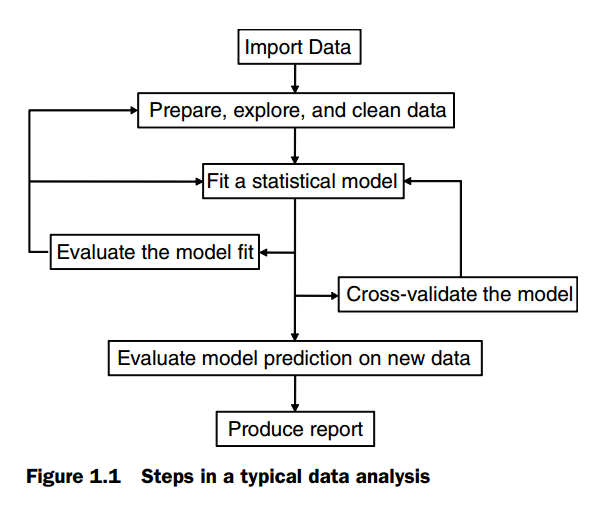

## 1 Introduction to R

### 1.1 Why use R?####

- Free
- All types of data analysis
- New statistical Methods in advanced statistical routine
- State-of-the-art graphics capabilities
- Interactive data analysis and exploration
- Import data from a wide variety of sources(text, DBMS, statistical Packages)
- Easily extensible
- Intergrated into other language
- Cross-platform(windows, Linux, Unix and Mac OSX even iphone)
- GUI

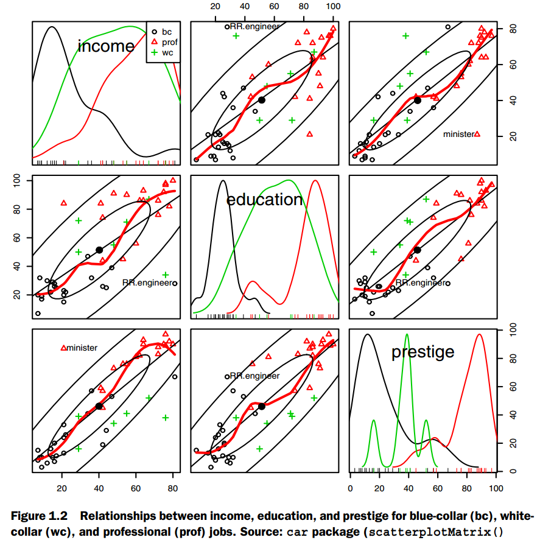

**Steep Learning Curve**

### 1.2 Obtaining and installing R

[ http://cran.r-project.org]( http://cran.r-project.org)

### 1.3 Working with R

#### 1.3.1 Getting Started

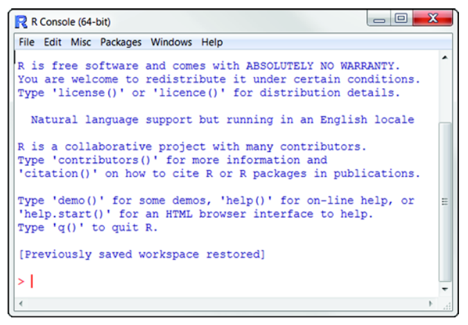


```
age <- c(1, 3, 5, 2, 11, 9, 3, 9, 12, 3)
weight <- c(4.4, 5.3, 7.2, 5.2, 8.5, 7.3, 6, 10.4,
    10.2, 6.1)
mean(weight)
sd(weight)
cor(age, weight)
plot(age, weight)
#mean 平均值　sd 标准差　cor 相关系数

```

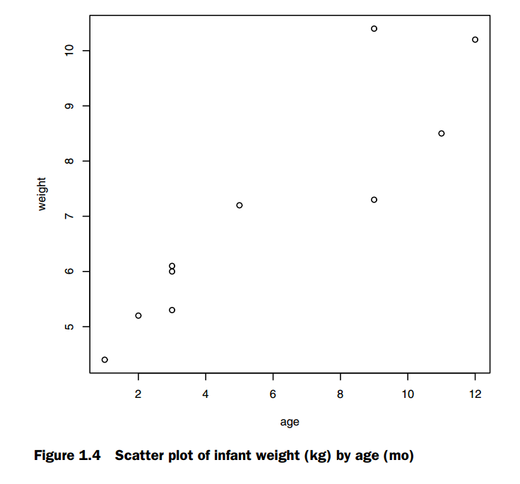

```
demo()
demo(Hershey)
demo(persp)
demo(image)
```
```
＃R demos
Demos in package ‘base’:

error.catching                            More examples on catching and handling errors
is.things                                 Explore some properties of R objects and is.FOO() functions. Not for newbies!
recursion                                 Using recursion for adaptive integration
scoping                                   An illustration of lexical scoping.

Demos in package ‘graphics’:

Hershey                                   Tables of the characters in the Hershey vector fonts
Japanese                                  Tables of the Japanese characters in the Hershey vector fonts
graphics                                  A show of some of R's graphics capabilities
image                                     The image-like graphics builtins of R
persp                                     Extended persp() examples
plotmath                                  Examples of the use of mathematics annotation

Demos in package ‘grDevices’:

colors                                    A show of R's predefined colors()
hclColors                                 Exploration of hcl() space

Demos in package ‘stats’:

glm.vr                                    Some glm() examples from V&R with several predictors
lm.glm                                    Some linear and generalized linear modelling examples from `An Introduction to
                                          Statistical Modelling' by Annette Dobson
nlm                                       Nonlinear least-squares using nlm()
smooth                                    `Visualize' steps in Tukey's smoothers


Use ‘demo(package = .packages(all.available = TRUE))’
to list the demos in all *available* packages.
```

-function.png)

```
#data set
Data sets in package ‘datasets’:

AirPassengers                             Monthly Airline Passenger Numbers 1949-1960
BJsales                                   Sales Data with Leading Indicator
BJsales.lead (BJsales)                    Sales Data with Leading Indicator
BOD                                       Biochemical Oxygen Demand
CO2                                       Carbon Dioxide Uptake in Grass Plants
ChickWeight                               Weight versus age of chicks on different diets
DNase                                     Elisa assay of DNase
EuStockMarkets                            Daily Closing Prices of Major European Stock Indices, 1991-1998
Formaldehyde                              Determination of Formaldehyde
HairEyeColor                              Hair and Eye Color of Statistics Students
Harman23.cor                              Harman Example 2.3
Harman74.cor                              Harman Example 7.4
Indometh                                  Pharmacokinetics of Indomethacin
InsectSprays                              Effectiveness of Insect Sprays
JohnsonJohnson                            Quarterly Earnings per Johnson & Johnson Share
LakeHuron                                 Level of Lake Huron 1875-1972
LifeCycleSavings                          Intercountry Life-Cycle Savings Data
Loblolly                                  Growth of Loblolly pine trees
Nile                                      Flow of the River Nile
Orange                                    Growth of Orange Trees
OrchardSprays                             Potency of Orchard Sprays
PlantGrowth                               Results from an Experiment on Plant Growth
Puromycin                                 Reaction Velocity of an Enzymatic Reaction
Seatbelts                                 Road Casualties in Great Britain 1969-84
Theoph                                    Pharmacokinetics of Theophylline
Titanic                                   Survival of passengers on the Titanic
ToothGrowth                               The Effect of Vitamin C on Tooth Growth in Guinea Pigs
UCBAdmissions                             Student Admissions at UC Berkeley
UKDriverDeaths                            Road Casualties in Great Britain 1969-84
UKgas                                     UK Quarterly Gas Consumption
USAccDeaths                               Accidental Deaths in the US 1973-1978
USArrests                                 Violent Crime Rates by US State
USJudgeRatings                            Lawyers' Ratings of State Judges in the US Superior Court
USPersonalExpenditure                     Personal Expenditure Data
UScitiesD                                 Distances Between European Cities and Between US Cities
VADeaths                                  Death Rates in Virginia (1940)
WWWusage                                  Internet Usage per Minute
WorldPhones                               The World's Telephones
ability.cov                               Ability and Intelligence Tests
airmiles                                  Passenger Miles on Commercial US Airlines, 1937-1960
airquality                                New York Air Quality Measurements
anscombe                                  Anscombe's Quartet of 'Identical' Simple Linear Regressions
attenu                                    The Joyner-Boore Attenuation Data
attitude                                  The Chatterjee-Price Attitude Data
austres                                   Quarterly Time Series of the Number of Australian Residents
beaver1 (beavers)                         Body Temperature Series of Two Beavers
beaver2 (beavers)                         Body Temperature Series of Two Beavers
cars                                      Speed and Stopping Distances of Cars
chickwts                                  Chicken Weights by Feed Type
co2                                       Mauna Loa Atmospheric CO2 Concentration
crimtab                                   Student's 3000 Criminals Data
discoveries                               Yearly Numbers of Important Discoveries
esoph                                     Smoking, Alcohol and (O)esophageal Cancer
euro                                      Conversion Rates of Euro Currencies
euro.cross (euro)                         Conversion Rates of Euro Currencies
eurodist                                  Distances Between European Cities and Between US Cities
faithful                                  Old Faithful Geyser Data
fdeaths (UKLungDeaths)                    Monthly Deaths from Lung Diseases in the UK
freeny                                    Freeny's Revenue Data
freeny.x (freeny)                         Freeny's Revenue Data
freeny.y (freeny)                         Freeny's Revenue Data
infert                                    Infertility after Spontaneous and Induced Abortion
iris                                      Edgar Anderson's Iris Data
iris3                                     Edgar Anderson's Iris Data
islands                                   Areas of the World's Major Landmasses
ldeaths (UKLungDeaths)                    Monthly Deaths from Lung Diseases in the UK
lh                                        Luteinizing Hormone in Blood Samples
longley                                   Longley's Economic Regression Data
lynx                                      Annual Canadian Lynx trappings 1821-1934
mdeaths (UKLungDeaths)                    Monthly Deaths from Lung Diseases in the UK
morley                                    Michelson Speed of Light Data
mtcars                                    Motor Trend Car Road Tests
nhtemp                                    Average Yearly Temperatures in New Haven
nottem                                    Average Monthly Temperatures at Nottingham, 1920-1939
npk                                       Classical N, P, K Factorial Experiment
occupationalStatus                        Occupational Status of Fathers and their Sons
precip                                    Annual Precipitation in US Cities
presidents                                Quarterly Approval Ratings of US Presidents
pressure                                  Vapor Pressure of Mercury as a Function of Temperature
quakes                                    Locations of Earthquakes off Fiji
randu                                     Random Numbers from Congruential Generator RANDU
rivers                                    Lengths of Major North American Rivers
rock                                      Measurements on Petroleum Rock Samples
sleep                                     Student's Sleep Data
stack.loss (stackloss)                    Brownlee's Stack Loss Plant Data
stack.x (stackloss)                       Brownlee's Stack Loss Plant Data
stackloss                                 Brownlee's Stack Loss Plant Data
state.abb (state)                         US State Facts and Figures
state.area (state)                        US State Facts and Figures
state.center (state)                      US State Facts and Figures
state.division (state)                    US State Facts and Figures
state.name (state)                        US State Facts and Figures
state.region (state)                      US State Facts and Figures
state.x77 (state)                         US State Facts and Figures
sunspot.month                             Monthly Sunspot Data, from 1749 to "Present"
sunspot.year                              Yearly Sunspot Data, 1700-1988
sunspots                                  Monthly Sunspot Numbers, 1749-1983
swiss                                     Swiss Fertility and Socioeconomic Indicators (1888) Data
treering                                  Yearly Treering Data, -6000-1979
trees                                     Girth, Height and Volume for Black Cherry Trees
uspop                                     Populations Recorded by the US Census
volcano                                   Topographic Information on Auckland's Maunga Whau Volcano
warpbreaks                                The Number of Breaks in Yarn during Weaving
women                                     Average Heights and Weights for American Women


Use ‘data(package = .packages(all.available = TRUE))’
to list the data sets in all *available* packages.
```


#### 1.3.2 Getting help

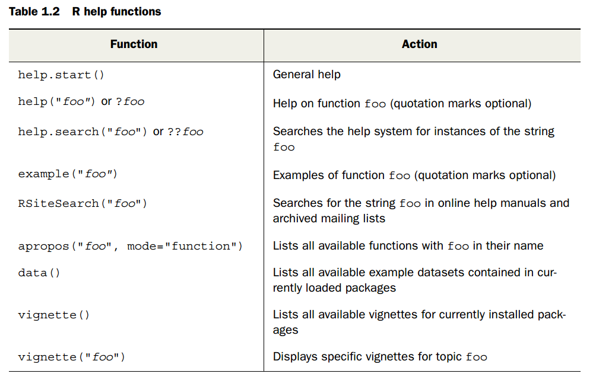

>apropos 可用的函数描述
vignette 可用插图文档

#### 1.3.3 The Workspace

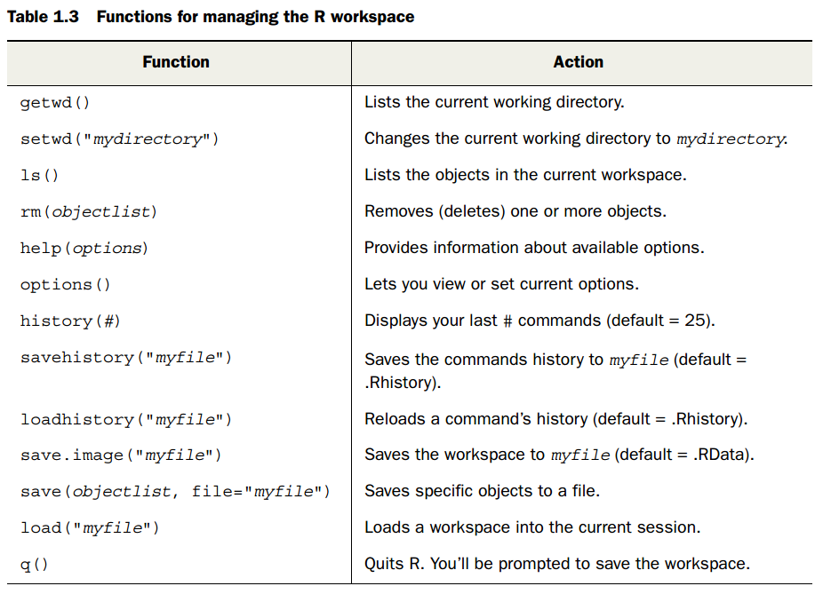

```
>getwd()
>setwd("/home/robin/project")
>options()
...
>options(digits=3)
> options(digits=3)
> x <- runif(20)
> summary(x)
   Min. 1st Qu.  Median    Mean 3rd Qu.    Max.
  0.090   0.320   0.432   0.507   0.729   0.945
> hist(x)
> savehistory()
> save.image()
```

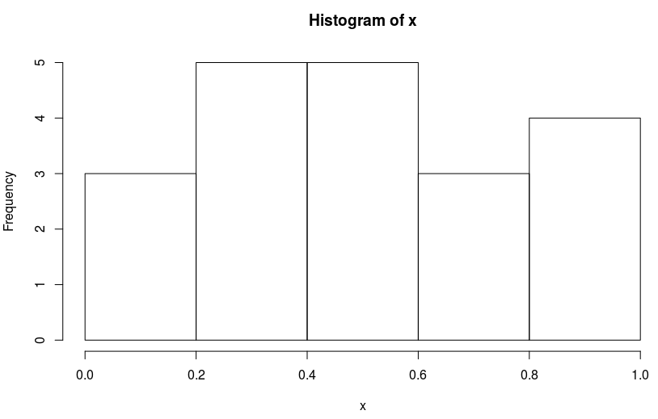

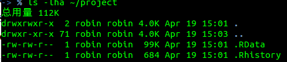

#### 1.3.4 Input and output

- input:  source("filename")
- text output:  sink("filename")
- graphic output:  png("filename.png")...  dev.off() to return to the terminal

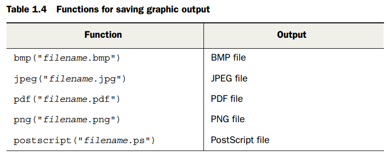
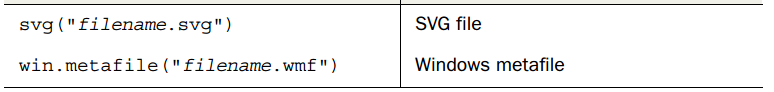

```
sink("myoutput", append=TRUE, split=TRUE)
pdf("mygraphs.pdf")
source("script.R")
```
```
sink()
dev.off()
source("script2.R")
```
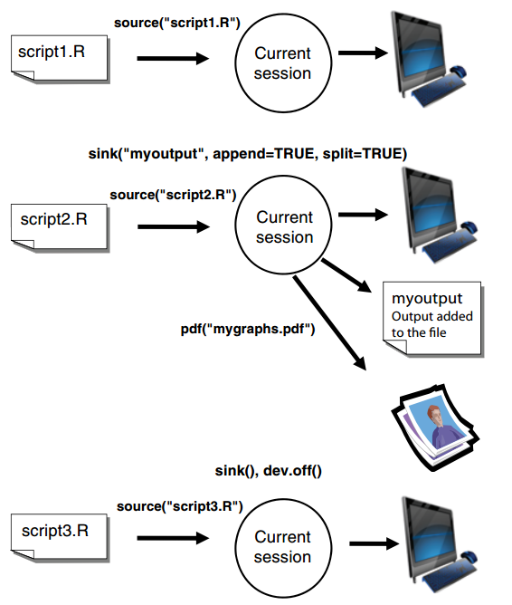

### 1.4 Packages

5500 user-contributed Packages, download from:
[http://cran.r-project.org/web/packages](http://cran.r-project.org/web/packages)

1.4.1 What are packages?

>**Packages** are collections of R functions, data, and compiled code in a well-defined formt.
The directory where packages are stored on is called the **library**

```
>.libPaths()
> [1] "/home/robin/R/x86_64-pc-linux-gnu-library/3.2" "/usr/local/lib/R/site-library"
  [3] "/usr/lib/R/site-library"                       "/usr/lib/R/library"   
> library()
```

```
‘/usr/lib/R/library’里有个程辑包：

base                                      The R Base Package
boot                                      Bootstrap Functions (Originally by Angelo Canty for S)
class                                     Functions for Classification
cluster                                   "Finding Groups in Data": Cluster Analysis Extended Rousseeuw et al.
codetools                                 Code Analysis Tools for R
compiler                                  The R Compiler Package
datasets                                  The R Datasets Package
foreign                                   Read Data Stored by Minitab, S, SAS, SPSS, Stata, Systat, Weka, dBase, ...
graphics                                  The R Graphics Package
grDevices                                 The R Graphics Devices and Support for Colours and Fonts
grid                                      The Grid Graphics Package
KernSmooth                                Functions for Kernel Smoothing Supporting Wand & Jones (1995)
lattice                                   Trellis Graphics for R
MASS                                      Support Functions and Datasets for Venables and Ripley's MASS
Matrix                                    Sparse and Dense Matrix Classes and Methods
methods                                   Formal Methods and Classes
mgcv                                      Mixed GAM Computation Vehicle with GCV/AIC/REML Smoothness Estimation
nlme                                      Linear and Nonlinear Mixed Effects Models
nnet                                      Feed-Forward Neural Networks and Multinomial Log-Linear Models
parallel                                  Support for Parallel computation in R
rpart                                     Recursive Partitioning and Regression Trees
spatial                                   Functions for Kriging and Point Pattern Analysis
splines                                   Regression Spline Functions and Classes
stats                                     The R Stats Package
stats4                                    Statistical Functions using S4 Classes
survival                                  Survival Analysis
tcltk                                     Tcl/Tk Interface
tools                                     Tools for Package Development
utils                                     The R Utils Package
```

```
> search()
 [1] ".GlobalEnv"        "tools:rstudio"     "package:stats"     "package:graphics"  "package:grDevices" "package:utils"    

 [7] "package:datasets"  "package:methods"   "Autoloads"         "package:base"     
```

#### 1.4.2 Installing a package

`install.packages()` without options brings up a list of CRAN mirror sites, select a site, select one download and install it. In rstudio, it install the package from default.

```
> install.packages("gclus")
Installing package into ‘/home/robin/R/x86_64-pc-linux-gnu-library/3.2’
(as ‘lib’ is unspecified)
--2016-04-19 15:34:21--  https://cran.rstudio.com/src/contrib/gclus_1.3.1.tar.gz
正在解析主机 cran.rstudio.com (cran.rstudio.com)... 204.246.164.231
正在连接 cran.rstudio.com (cran.rstudio.com)|204.246.164.231|:443... 已连接。
已发出 HTTP 请求，正在等待回应... 200 OK
长度： 42183 (41K) [application/x-gzip]
正在保存至: “/tmp/RtmpJeqGsD/downloaded_packages/gclus_1.3.1.tar.gz”

     0K .......... .......... .......... .......... .         100% 66.0K=0.6s

2016-04-19 15:34:24 (66.0 KB/s) - 已保存 “/tmp/RtmpJeqGsD/downloaded_packages/gclus_1.3.1.tar.gz” [42183/42183])

* installing *source* package ‘gclus’ ...
** 成功将‘gclus’程序包解包并MD5和检查
** R
** data
** preparing package for lazy loading
** help
*** installing help indices
** building package indices
** testing if installed package can be loaded
* DONE (gclus)

The downloaded source packages are in
	‘/tmp/RtmpJeqGsD/downloaded_packages’
```

`update.packages`: update any packages

`installed.packages`: the details on your packages

1.4.3 Loading a package

`library(package-name)` load the package
```
> library(gclus)
载入需要的程辑包：cluster
```

1.4.4 Learning about a package

`help(package="package_name")` provides a brief description of the package and an index of the functions and datasets included.

```
>help.start()
>install.packages("vcd")
>help(package = "vcd")
>library(vcd)
>help(Arthritis)
>Arthritis
>example(Arthritis)
Arthrt> data("Arthritis")

Arthrt> art <- xtabs(~ Treatment + Improved, data = Arthritis, subset = Sex == "Female")

Arthrt> art
         Improved
Treatment None Some Marked
  Placebo   19    7      6
  Treated    6    5     16

Arthrt> mosaic(art, gp = shading_Friendly)
```
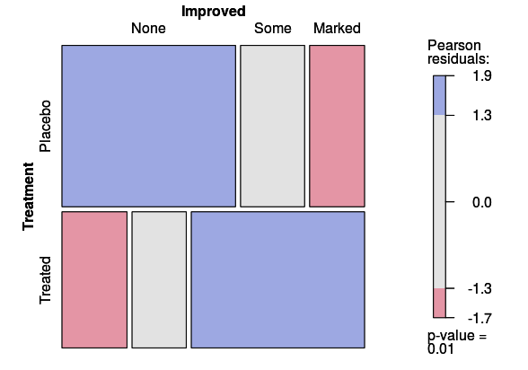

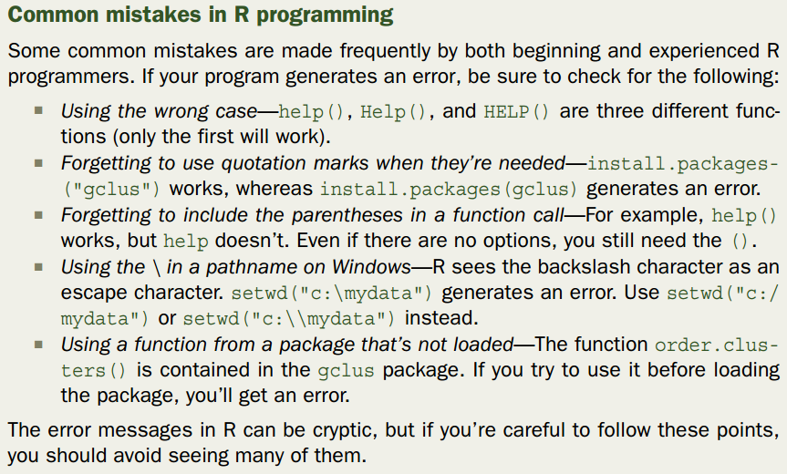

### 1.5 Batch processing

generate the same report one a month, run R scrips in batch mode.

```
R CMD BATCH options infile outfile
```

```
R CMD BATCH --vanilla --slave "myscript.R"
```

### 1.6 Using output as input: reusing results

```
> lm(mpg~wt, data=mtcars)
> lmfit <- lm(mpg~wt, data=mtcars)
#save the result in lmfit
> summary(lmfit)
> plot(lmfit)
> predict(lmfit, mynewdata)
```

### 1.7 Working with large datasets

>R can handle data analysis problems in the gigabyte to terabyte, but specialized procedures are required.

### 1.8 Working through an example

```
help.start()
install.packages("vcd")
help(package = "vcd")
library(vcd)
help(Arthritis)
Arthritis
example(Arthritis)
```

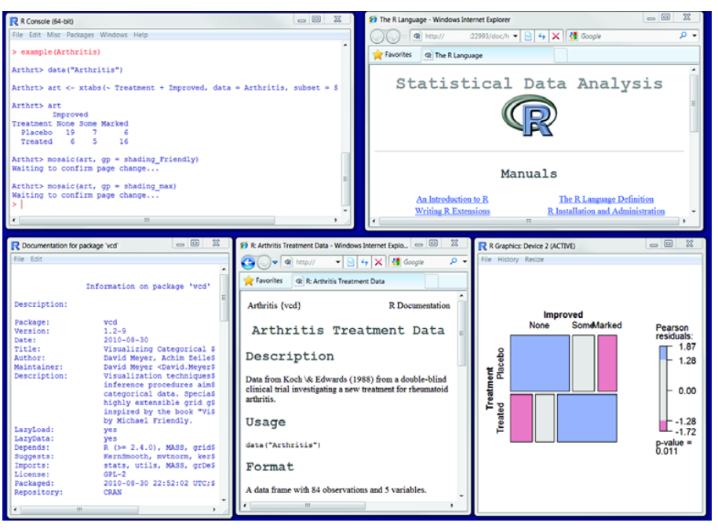

### 1.9 Summary
